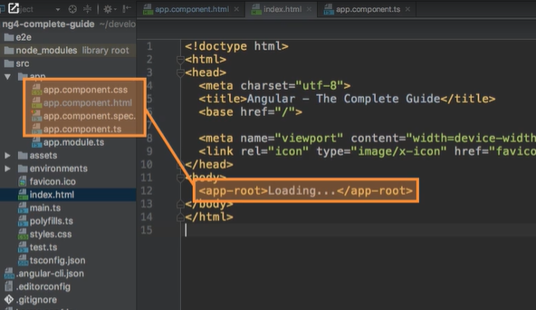
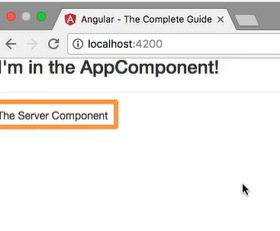
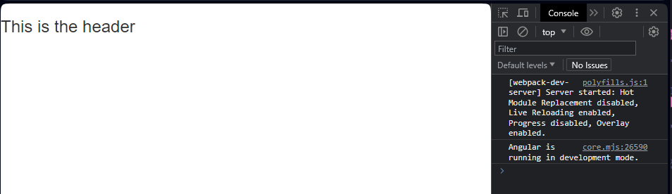
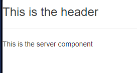
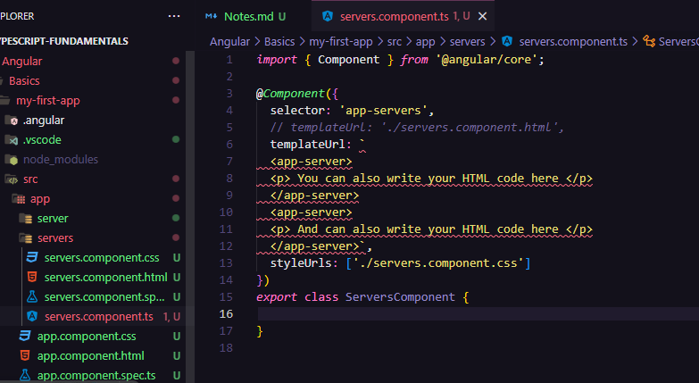
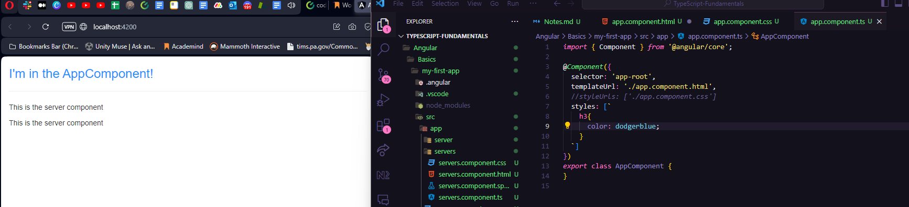
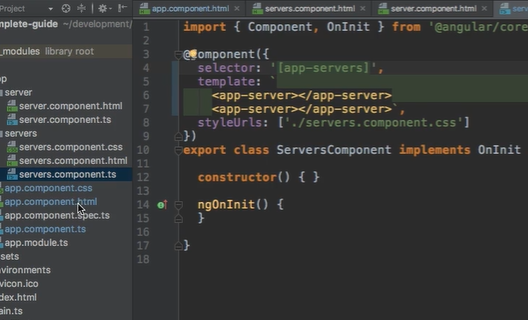
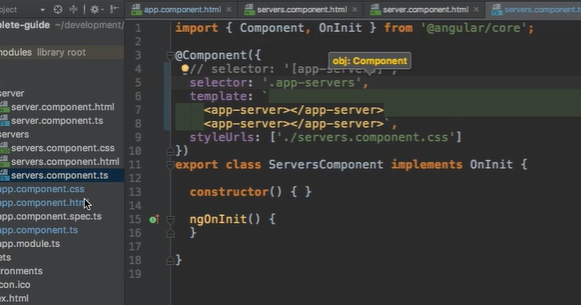
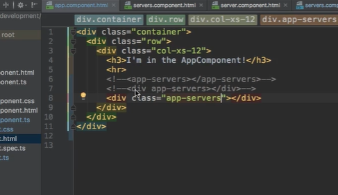

# Quickstart for a New Angular Setup

npm install -g @angular/cli@latest

cd documents/github/[myprojectfolder]/Angular/[specificprojectname]

ng new my-first-app --no-strict

Choose "CSS"

npm install --save bootstrap@3

ng serve (to test)

*Looks like I can copy a project into another folder w/o interferrance. Success!*

#### 1. How an Angular App gets Loaded and Started

Index.html file is the main file... Angular is linking to the component html.

We do not see the loading screen. the app root is in change of all in the app folder

How Angular is triggered:
main.ts connects to different scripts...

app.component = html
main.ts = main doc

... and other docs

#### 2. Components are important

Angular in the end is a JS framework, changing the DOM (html) at runtime

- Components (the html part)
- you will be able to use components more than once, so you don't need to cram everything into one html file

#### 3. Creating a New component

Folder name should = component name

*Make a folder called "server" and name a new file*

server.component.ts

Add "@Component" and " import { Component } from '@angular/core'; "

...to tell it's not just a ts class, it's a special component. It enhances your code

Decorators always have an "@" sign

#### 4. Understanding the Role of AppModule and Component Declaration

What is AppModule?
Angular uses modules to bundle different pieces, components of the app, into packages

add to @NgModule "ServerComponent"
import {ServerComponent} from './server/server.component';

#### 5. Using Custom Components

The plugin name is 'emmet'. Google for 'YOUR_EDITOR + emmet' to learn how to integrate it in your editor

*Note to self:*

This tutorial is outdated and I didn't get the same results. Tried to copy EXACTLY what was on the instructors files. Looks like

@Angular/http

is outdated. Going to use CommonModule instead @Angular/common

*IMPORTANT NOTE I DID NOT GET THE SERVER AND MAIN HTML TO SPEAK TO ONE ANOTHER*

**Update: I got the header/paragraph mixed up between the server component and the app component.**

App = Main

Server = Server

#### 6. Creating Components with the CLI & Nesting Components

ng generate component servers
OR

ng g c servers

Allows us to generate some elements by Angular. It will make a brand new folder called "servers"

Okay... so we are grabbing from the OG "server" file, but using "servers" as a commonplace for each server. Then the app mushes it all together!

#### 7. Working with Component Templates

Can also use inline template. Instead of working with multiple servers, can also find html code in typescript code!

The app component trumps the CSS stylings in the css doc

#### 8. Fully Understanding the Component Selector

This is what happens when you change a selector to become an attribute (to be changed in docs like CSS file)

Oh! But you can use it as an attribute in a div...

**Selecting by ID, or any of the sudo selectors like "hover" will NOT WORK.**

#### 9. Assignment: Component Basics (Problem)

1. Create two new Components (manually or with CLI): WarningAlert and SuccessAlert

*What is CLI in Angular?*
*The Angular CLI is a command-line interface tool that you use to initialize, develop, scaffold, and maintain Angular applications directly from a command shell.*

**We are going the quick route**

ng g c success-alert

ng g c warning-alert

*This makes the two NEW servers*

2. Output them beneath each other in the AppComponent

*This is the doc that is housing our HTML*

3. Output a warning or success message in the Components

*This came pre-configured, just going to edit them slightly*

4. Style the Components appropriately (maybe some red/green text?)

Use external or internal templates and styles!

*OH! I can edit the CSS of each server. That's cool. Going that route*

*Using a pre-made auto adds your component to the app.module.ts CLI*

Feel free to create more components, nest them into each other or play around with different types of selectors!

*The only thing I updated was deleting the TS file from the pre-made folders. To make it cleaner*

[updated server](image-10.png)

#### 10. What is Databinding?

We've been mostly working with static stuff. Let's get some dynamic non-hardcoded stuff.

Databinding = communication (between TS, components, business logic and your html)

Output Data ===>
String Interpolation ({{ data }})
Property Binding ([property]="data")

<=== React to (user) events
Event Binding ((event)="expression")

Combination of Both: Two-Way-Binding ([(ngModel)]="data")

#### 11. 

#### 12. 