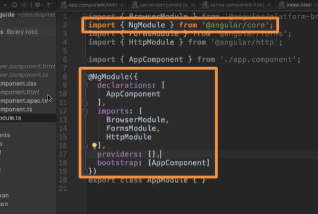

# Quickstart for a New Angular Setup

npm install -g @angular/cli@latest

cd documents/github/[myprojectfolder]/Angular/[specificprojectname]

ng new my-first-app --no-strict

Choose "CSS"

npm install --save bootstrap@3

ng serve (to test)

*Looks like I can copy a project into another folder w/o interferrance. Success!*

#### 1. How an Angular App gets Loaded and Started

Index.html file is the main file... Angular is linking to the component html.

We do not see the loading screen. the app root is in change of all in the app folder

How Angular is triggered:
main.ts connects to different scripts...

app.component = html
main.ts = main doc

... and other docs

#### 2. Components are important

Angular in the end is a JS framework, changing the DOM (html) at runtime

- Components (the html part)
- you will be able to use components more than once, so you don't need to cram everything into one html file

#### 3. Creating a New component

Folder name should = component name

*Make a folder called "server" and name a new file*

server.component.ts

Add "@Component" and " import { Component } from '@angular/core'; "

...to tell it's not just a ts class, it's a special component. It enhances your code

Decorators always have an "@" sign

#### 4. Understanding the Role of AppModule and Component Declaration

What is AppModule?
Angular uses modules to bundle different pieces, components of the app, into packages

add to @NgModule "ServerComponent"
import {ServerComponent} from './server/server.component';

#### 5. Using Custom Components

The plugin name is 'emmet'. Google for 'YOUR_EDITOR + emmet' to learn how to integrate it in your editor

*Note to self:*

This tutorial is outdated and I didn't get the same results. Tried to copy EXACTLY what was on the instructors files. Looks like

@Angular/http

is outdated. Going to use CommonModule instead @Angular/common

*IMPORTANT NOTE I DID NOT GET THE SERVER AND MAIN HTML TO SPEAK TO ONE ANOTHER*

**Update: I got the header/paragraph mixed up between the server component and the app component.**

App = Main

Server = Server

#### 6. Creating Components with the CLI & Nesting Components

ng generate component servers
OR

ng g c servers

Allows us to generate some elements by Angular. It will make a brand new folder called "servers"

Okay... so we are grabbing from the OG "server" file, but using "servers" as a commonplace for each server. Then the app mushes it all together!

#### 7. Working with Component Templates

Can also use inline template. Instead of working with multiple servers, can also find html code in typescript code!

The app component trumps the CSS stylings in the css doc

#### 8. Fully Understanding the Component Selector

This is what happens when you change a selector to become an attribute (to be changed in docs like CSS file)

Oh! But you can use it as an attribute in a div...

**Selecting by ID, or any of the sudo selectors like "hover" will NOT WORK.**

#### 9. Assignment: Component Basics (Problem)

1. Create two new Components (manually or with CLI): WarningAlert and SuccessAlert

*What is CLI in Angular?*
*The Angular CLI is a command-line interface tool that you use to initialize, develop, scaffold, and maintain Angular applications directly from a command shell.*

**We are going the quick route**

ng g c success-alert

ng g c warning-alert

*This makes the two NEW servers*

2. Output them beneath each other in the AppComponent

*This is the doc that is housing our HTML*

3. Output a warning or success message in the Components

*This came pre-configured, just going to edit them slightly*

4. Style the Components appropriately (maybe some red/green text?)

Use external or internal templates and styles!

*OH! I can edit the CSS of each server. That's cool. Going that route*

*Using a pre-made auto adds your component to the app.module.ts CLI*

Feel free to create more components, nest them into each other or play around with different types of selectors!

*The only thing I updated was deleting the TS file from the pre-made folders. To make it cleaner*

[updated server](image-10.png)

#### 10. What is Databinding?

We've been mostly working with static stuff. Let's get some dynamic non-hardcoded stuff.

Databinding = communication (between TS, components, business logic and your html)

Output Data ===>
String Interpolation ({{ data }})
Property Binding ([property]="data")

<=== React to (user) events
Event Binding ((event)="expression")

Combination of Both: Two-Way-Binding ([(ngModel)]="data")

#### 11. String Interpolation

Notice: don't have to list number or string, those are inferred

Okay, so this is showing that we can add statuses from different servers

#### 12. Property Binding

*the button was teensy b/c there was no text put into it!*

Hmm... I guess reinstalling bootstrap didn't solve the styling issue. Oh well, at least I'm certain it's installed!

[] <-- This tells Angular we are "property-binding". Want to dynamically bind some property, disable some html attribute

Ah! So it takes a sec for the button to become active, because it's updating dynamically

#### 13. Property Binding vs String Interpolation

You can do EITHER line to get the boolean to print on the page

String interpolation: Just print some text to your page, use this one (this is the plain paragraph one)

{{ allowNewServer }}

Property-Binding: Want to change some property, off html element or a directive or component (this is binding it with the property paragraph)

*String interpolation ONLY works in a normal template, not within another expression of that template, like in property binding*

#### 14. Event Binding

Event binding uses ()=""

#### 15. Passing and Using Data with Event Binding

($event) is SUPER important, reserved variable name you can use in the template when using event binding. The data emitted with that event

We can *emphasize* that we are using the HTML Input Element event target here. Since it's being finicky.

**Yay! Now we've made it so we log the data in real time**

#### 16. Two-Way-Databinding

**Important: For Two-Way-Binding (covered in this lecture) to work, you need to enable the ngModel directive. This is done by adding the FormsModule to the imports[] array in the AppModule.**

You then also need to add the import from @angular/forms in the app.module.ts file:

import { FormsModule } from '@angular/forms';

*note to self, be sure to get rid of the 
 tag b/c it does some funkiness to the bound data*

#### 17. Combining all Forms of Databinding

#### 18. Assignment: Data & Event Binding (Problem)

1. Add an input field which updates a property ('username') via Two-Way-Binding

*I'm going to do this in the success-alert server*

 (the hr to form control portion at bottom)

2. Output the username property via String Interpolation (in a paragraph below the input)

3. Add a button which may only be clicked if the username is NOT an empty string

4. Upon clicking the button, the username should be reset to an empty string

Okay! Now the button clicks and it gives an empty field...

#### 19. Understanding Directives

Directives are instructions in the DOM

Components are kinda such instructions in the DOM

Recieves a green background!

#### 20. Using ngIf to Output Data Conditionally

You NEED the little star
*ngIf=""

#### 21. Enhancing ngIf with an Else Condition

*Local reference (will be discussed LATER)*
#=""

#### 22. Styling Elements Dynamically with ngStyle

Unlike structural directives, attribute directives don't add or remove elements. They only change the element they were placed on

Need property binding on ngStyle to style our notifications for the servers

*Note: Directive and property binding are NOT the same thing*

Now when you click refresh it will change the background like a coin toss

#### 23. Applying CSS Classes Dynamically with ngClass

{} <-- JS Object

Okie dokie! So now the font for the online portion is on.

#### 24. Outputting Lists with ngFor

*ngFor=""

define a temp variable, give it any name

<app-server *ngFor="let server of servers"></app-server>

NEAT! It makes more "servers". Server farm heh.

#### 25. Assignment: Directives (Problem)

1. Add a button which says 'Display Details'

2. Add a paragraph with any content of your choice

3. Toggle the displaying of that paragraph with the button created in the first step

4. Log all button clicks in an array and output that array below the secret paragraph (maybe log a timestamp or simply an incrementing number)

5. Starting at the 5th log item, give all future log items a blue background (via ngStyle) and white color (ngClass)

#### 26. Getting the Index when using ngFor

the little extra something something to replace bigger words with an index

